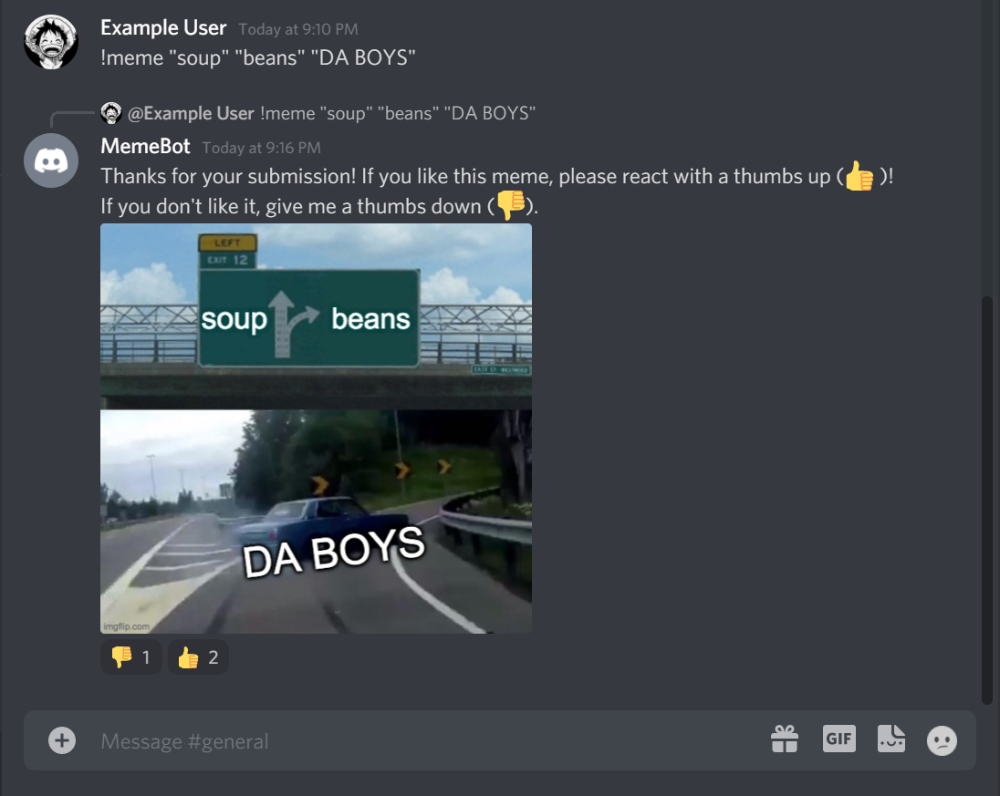
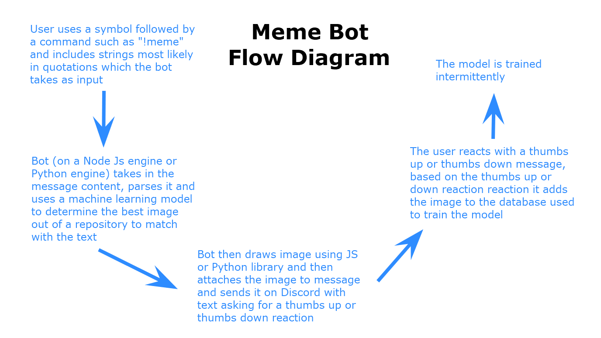

# Design Workshop Notes

## Idea 1: FileBot

### The Problem to Solve
Converting files is a very frequent (and sometimes inconvenient!) task in online work. For instance, in collaborative environments, users may want to convert between Word and PDF depending on their preferred file type, and they would need to convert back to match the remote, shared version.

Sometimes, these file conversions rely on the use of online services. Although these services are free, they present a privacy concern by nature of taking in files for conversion.

In sum, although converting files is a frequent online task, using online services to do it can be a concern of both privacy and convenience.

### Product Idea
Out FileBot will be a Discord bot that allows users to input files in a message, provide some conversion settings, and have the bot return the converted files. All of this conversion will be done in-place by the bot's onboard code: in other words, it will not (or will *avoid*) using online services for conversion.

Design-wise, this bot will use a basic pattern of Discord messages and attachments. By sending the message to the bot with the file as an attachment, the bot will respond with a (converted) attachment of its own. Another pattern we may use is S3 Buckets. This is a consequence of Discord's file size limit of 8MB. If a file is larger, these buckets (powered by AWS) can store the large files as hyperlinks which could be returned by the bot instead of a direct attachments.

## Idea 2: MemeBot

### The Problem to Solve

Memes have become a cornerstone of online culture. Namely, online meme generators allow people to quickly and easily construct memes. However, there is no quick or convenient way to do this on Discord. Because Discord is such a popular platform for socializing, having a fast meme generator here would be beneficial.

This process can be further streamlined (and become more interesting!) using machine learning. Recently, AI have been trained to recognize and tag images, simulate users, or even make memes themselves. This bot will belong in the latter category: taking in user text input, the bot will find an image and assemble the meme on its own. This would make the meme creation process even faster for users that call the bot (or, perhaps, make even better memes if the bot returns some unexpected results!).

### Product Idea
MemeBot will be a Discord bot that takes in user input as strings (closed in quotes, for instance), automatically finds an image to correspond to it, then composes the two into meme.

This process will be facilitated by machine learning: by training on memes, the bot will be able to best select and present images that correspond to users' text. The machine learning process will be done online; then, the selection network will be saved and presented stably within the bot.

As for design patterns, this bot makes use of the common "bot call" tag, followed by simple strings in quotes. This input method should be quick and simple for users to call on. The bot also makes use of Discord reactions so that users can return input as to whether they like their generated meme or not.

## Team Decision
After further discussion, the team agreed to focus on the Memebot project for this semester. See our wireframe and flow diagram below.

